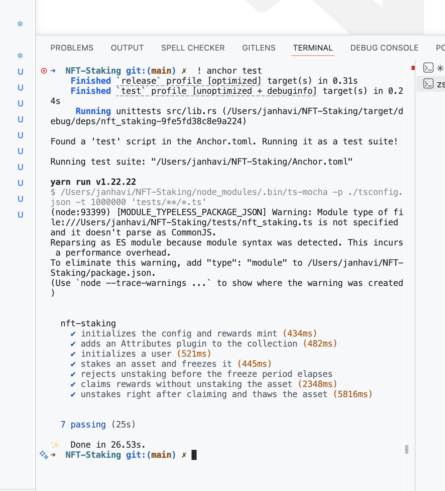

# NFT Staking (Metaplex Core)

An Anchor program for staking Metaplex Core NFTs. Staking freezes an asset in
place, accrues reward points over time, and lets the holder mint those points as
SPL tokens. The collection keeps a live count of how many of its assets are
staked.

Written from scratch for the Week 5 assignment, with both extra challenges:

1. **Claiming is its own instruction**, separate from unstaking. A holder can
   claim rewards while the asset stays staked, and can unstake right after a
   claim.
2. **The collection carries an Attributes plugin** that tracks how many of its
   assets are staked, updated by the program on every stake and unstake.

## How it works

Each deployment has a single config tied to one Core collection, plus a reward
mint the program controls. Per user there is one account tracking unclaimed
points and how many assets they have staked; per staked asset there is a small
record created on stake and closed on unstake.

Staking adds a `FreezeDelegate` plugin to the asset with `frozen = true` and
delegates thaw rights to the asset's stake PDA, so the owner can no longer move
the asset but the program can release it later. Unstaking thaws the asset, has
the owner remove the now-unused freeze plugin, and closes the stake record.

### Rewards

Points accrue per second per staked asset at the configured `points_per_stake`
rate. Both `claim` and `unstake` settle the points an asset has earned since the
last settlement, so nothing is lost by claiming late or by unstaking. `claim`
mints the user's whole point balance as reward tokens (one point = one token, the
mint has 6 decimals) and resets the balance to zero; the asset keeps earning.

### Instructions

| Instruction             | What it does |
| ----------------------- | ------------ |
| `initialize_config`     | Creates the config PDA and the reward mint, and records the collection. |
| `initialize_collection` | Adds the Attributes plugin (`staked = 0`) to the collection, owned by the config PDA. |
| `initialize_user`       | Creates the caller's staking record. |
| `stake`                 | Freezes the asset, opens a stake record, and raises the staked count. |
| `claim`                 | Settles and mints accrued reward points without unstaking. |
| `unstake`               | Enforces the freeze period, settles rewards, thaws and unfreezes the asset, closes the record, and lowers the staked count. |

## A note on the Metaplex Core CPI

No published `mpl-core` Rust crate lines up with this toolchain (Anchor `0.32.1`
/ Solana `3.1.x`): older versions pin Solana 1.x, newer ones pull the Solana 4.x
types, and neither unifies with Anchor's account types. Rather than downgrade the
whole toolchain, the program talks to Core directly. The `mpl_core` module
rebuilds the five instructions it needs (freeze, thaw, remove freeze, add and
update collection attributes) from their borsh layouts and discriminators, and
invokes them with `invoke` / `invoke_signed`. This keeps the on-chain crate
dependent only on `anchor-lang` and `anchor-spl`.

## Layout

```
programs/nft_staking/src
├── lib.rs                     program entrypoints
├── state.rs                   StakeConfig, UserAccount, StakeAccount
├── error.rs                   custom errors
├── mpl_core.rs                hand-built Metaplex Core CPI client
└── instructions/             one module per instruction
tests/nft_staking.ts           integration test suite
tests/fixtures/mpl_core.so     Core program, loaded into the local validator
```

## Build and test

Requirements: Rust, Solana CLI `3.1.x`, Anchor `0.32.1`, Node and Yarn.

```bash
yarn install
anchor test
```

`anchor test` builds the program, starts a local validator with the Metaplex
Core program loaded from `tests/fixtures/mpl_core.so`, deploys, and runs the
suite.

To refresh the fixture, dump it from mainnet:

```bash
solana program dump -u m CoREENxT6tW1HoK8ypY1SxRMZTcVPm7R94rH4PZNhX7d tests/fixtures/mpl_core.so
```

## Tests

The suite mints a real Core collection and asset with umi, then exercises every
instruction:

- initializes the config and reward mint
- adds the Attributes plugin and checks `staked = 0`
- initializes a user
- stakes an asset and verifies it is frozen, the user count is 1, and the
  collection attribute reads `1`
- rejects unstaking before the freeze period, leaving the asset frozen
- claims rewards while the asset stays staked, then checks tokens were minted and
  points reset
- claims again and unstakes right after, then verifies the asset is thawed and
  the freeze plugin gone, the stake record is closed, and the staked count and
  collection attribute are back to `0`

All seven pass against a local validator:


